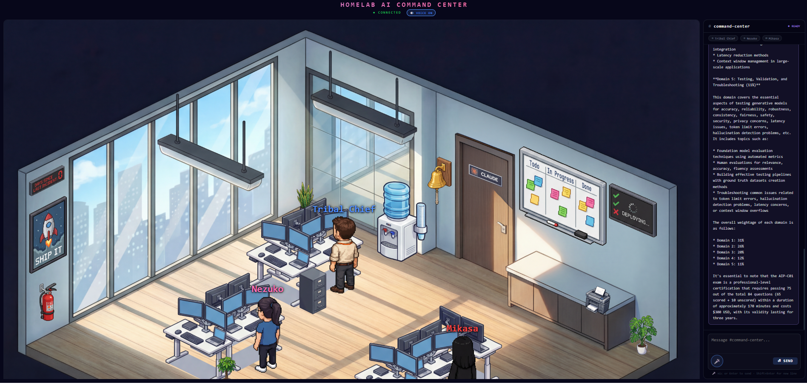

# AI Command Center

> A production-grade local AI infrastructure stack implementing enterprise MLOps and LLMOps patterns — fully air-gapped, zero cloud dependency, built from scratch. Deploys to AWS on demand.



**Live multi-agent system** where six specialized AI agents — Tribal Chief (Director), Nezuko (Researcher), Mikasa (Executor), Levi (Security), Eren (DevOps), and Armin (Assistant) — collaborate in real time to answer questions, search knowledge bases, audit security, check infrastructure, and manage your Google Workspace. Speak to them via voice. Watch them walk across an animated office to hand off tasks.

---

## What This Demonstrates

This project implements the full AI infrastructure stack — from local LLM serving to multi-agent orchestration, evaluation, observability, Google Workspace integration, AWS Bedrock Guardrails, and a live voice-enabled UI. Every component maps to an AWS managed service:

| Capability | Implementation | AWS Equivalent |
|---|---|---|
| LLM serving | Ollama + llama3.2:3b + phi3:mini | Bedrock InvokeModel |
| Vector search + RAG | Qdrant + LangChain + sentence-transformers | Bedrock Knowledge Bases |
| Multi-agent orchestration | 6-agent async pipeline + WebSocket streaming | Bedrock Agents + Action Groups |
| Content safety | AWS Bedrock Guardrails | Amazon Bedrock Guardrails |
| AI evaluation pipeline | pytest + 32 eval tests + GitHub Actions | SageMaker Pipelines |
| Experiment tracking | MLflow 2.11.1 + PostgreSQL | SageMaker Experiments |
| Observability | Prometheus + Grafana + Evidently AI | CloudWatch + Managed Grafana |
| Security | API key auth + Docker socket proxy + threat model | IAM + API Gateway |
| Voice interface | Web Speech API + ElevenLabs TTS | Lex + Polly |
| Google Workspace | Calendar, Gmail, Drive, Notion via OAuth2 | Google Workspace connector |
| Conversation memory | PostgreSQL conversation history | Amazon DynamoDB |
| Scheduled tasks | APScheduler morning briefing at 8AM EST | Amazon EventBridge |
| Cloud deployment | ECS Fargate + S3 + CloudFront | Production AWS stack |
| Live UI | React + isometric office + animated agents | CloudFront + S3 |

---

## Architecture

```
+------------------------------------------------------------------+
|                    AI COMMAND CENTER                      |
|                                                                   |
|  +--------------+    WebSocket     +--------------------------+   |
|  |   React UI   |<---------------->|   Multi-Agent Pipeline   |   |
|  |  (Stage 6)   |                  |       (Stage 5)          |   |
|  |              |                  |                          |   |
|  | Isometric    |                  |  Tribal Chief (Planner)  |   |
|  | office scene |                  |  Nezuko    (Researcher)  |   |
|  | Voice I/O    |                  |  Mikasa    (Executor)    |   |
|  | 6 characters |                  |  Levi      (Security)    |   |
|  +--------------+                  |  Eren      (DevOps)      |   |
|                                    |  Armin     (Assistant)   |   |
|                                    +----------+---------------+   |
|                                               |                   |
|         +-------------------------------------+                   |
|         |           |           |             |                   |
|  +------+----+ +----+----+ +----+----+ +------+----+             |
|  | RAG       | | Agent   | | Bedrock | | Google    |             |
|  | Pipeline  | | Tools   | | Guards  | | Workspace |             |
|  | (Stage 2) | | (2.5)   | | rails   | | Calendar  |             |
|  |           | |         | |         | | Gmail     |             |
|  | Qdrant    | | Docker  | | Content | | Drive     |             |
|  | LangChain | | Metrics | | Filter  | | Notion    |             |
|  | FastAPI   | | System  | | PII     |  +----------+             |
|  +-----------+ +---------+ +---------+                           |
|                                                                   |
|  +-----------+  +----------+  +------------------+               |
|  | Local LLMs|  | MLflow   |  | Observability    |               |
|  | (Stage 1) |  | (Stage 1)|  | (Stage 4)        |               |
|  | llama3.2  |  | Tracking |  | Prometheus       |               |
|  | phi3:mini |  | Postgres |  | Grafana          |               |
|  | Ollama    |  |          |  | Evidently AI     |               |
|  +-----------+  +----------+  +------------------+               |
|                                                                   |
|  +-------------------------------------------------------------+  |
|  | CI/CD + Security (Stage 3 + Security)                       |  |
|  | GitHub Actions * pytest 32 tests * API key auth *           |  |
|  | Docker socket proxy * Bedrock Guardrails * Threat model     |  |
|  +-------------------------------------------------------------+  |
+------------------------------------------------------------------+
```

---

## Stack at a Glance

```
Runtime:       Windows 11 + WSL2 (Ubuntu 22.04)
Hardware:      Intel i7-1260P * 16GB RAM * CPU-only inference
LLM:           llama3.2:3b + phi3:mini via Ollama
Cloud LLM:     Nova Micro (planning) + Claude Haiku 4.5 (synthesis) via Bedrock
Embeddings:    all-MiniLM-L6-v2 (384-dim) via sentence-transformers
Vector DB:     Qdrant
Orchestration: LangChain + custom async agent pipeline
API:           FastAPI + Pydantic
Streaming:     WebSocket (real-time agent events)
Tracking:      MLflow 2.11.1 + PostgreSQL
Monitoring:    Prometheus + Grafana + Evidently AI
Memory:        PostgreSQL (conversation history)
Scheduler:     APScheduler (morning briefing at 8AM EST)
CI/CD:         GitHub Actions (build + eval pipeline)
Testing:       pytest (32 tests, 100% passing)
UI:            React 18 + Vite + Nginx
Voice:         Web Speech API + ElevenLabs TTS
Containers:    Docker Compose (14 services)
Cloud:         ECS Fargate + S3 + CloudFront + ECR
```

---

## Agents

| Agent | Role | Tools | Voice |
|---|---|---|---|
| Tribal Chief | Director | Plans, delegates, synthesizes, remembers | Brian — Deep, Resonant |
| Nezuko | Researcher | RAG knowledge base semantic search | Sarah — Mature, Reassuring |
| Mikasa | Executor | Docker status, system metrics | Alice — Clear, Engaging |
| Levi | Security Auditor | Port exposure, API key health, auth checks | George — Warm, Captivating |
| Eren | DevOps Engineer | Service health, Prometheus targets | Charlie — Deep, Confident |
| Armin | Personal Assistant | Google Calendar, Gmail, Drive, Notion | Jessica — Playful, Warm |

---

## Stages

### [Stage 1 — Local AI Serving Stack](./stage1)
Ollama serving llama3.2:3b and phi3:mini with MLflow experiment tracking backed by PostgreSQL.

**Key decisions:** Custom MLflow Dockerfile with psycopg2 baked in, named Docker volumes for persistence, healthcheck patterns for correct startup order.

### [Stage 2 — RAG Pipeline](./stage2)
Production-grade Retrieval-Augmented Generation pipeline with Qdrant, LangChain, and FastAPI.

**Key decisions:** Embeddings baked into Docker image at build time (no runtime downloads), API key auth on all endpoints, Prometheus metrics instrumented, Evidently AI for answer quality monitoring.

**Endpoints:** `/ingest` * `/query` * `/collections` * `/health` * `/metrics`

### [Stage 2.5 — DevOps AI Agent](./stage2.5)
Single-agent system with tool routing — Docker inspection, system metrics, RAG search.

**Key decisions:** Docker socket proxy instead of raw socket mount (read-only access), two-step LLM routing pattern for reliability.

### [Stage 3 — CI/CD Evaluation Pipeline](./stage3)
32 pytest tests on GitHub Actions covering RAG quality, auth, agent routing, and response contracts.

**Key decisions:** CI runs syntax validation only (no LLM inference on CI runners), tests structured as regression guards not unit tests.

### [Security](./security)
API key auth, Docker socket proxy, documented threat model.

### [Stage 4 — Monitoring + Observability](./stage4)
Prometheus + Grafana + Evidently AI. Dashboard auto-provisioned on startup.

**Ports:** Prometheus :9090 * Grafana :3000 * Evidently :8050 * Node Exporter :9100

### [Stage 5 — Multi-Agent Orchestration](./stage5)
Six specialized agents with keyword routing, AWS Bedrock integration, Bedrock Guardrails, conversation memory, Google Workspace integration, and automated morning briefing.

**Key decisions:** Async generator pipeline for real-time streaming, keyword routing overrides unreliable local LLM routing, PostgreSQL memory is non-blocking, Guardrails fail open so errors never break the pipeline.

**Endpoints:** `WS /ws` * `POST /task` * `GET /health`

### [Stage 6 — Live Agent UI](./stage6)
Animated isometric office with 6 character sprites, Slack-style chat panel, ElevenLabs voice, and Stop button.

**Key decisions:** Sprite images over canvas, useRoomScale hook for responsive scaling, animation queue for sequential walk steps, voice fires only on mic input, no auto-send on voice transcript.

---

## Quick Start

### Prerequisites
- Docker Desktop with WSL2 backend
- 8GB+ RAM available to Docker
- ~10GB disk for models

### Start sequence
```bash
docker compose -f security/docker-compose.yml up -d
docker compose -f stage1/docker-compose.yml up -d
docker compose -f stage2/docker-compose.yml up -d
docker compose -f stage2.5/docker-compose.yml up -d
docker compose -f stage4/docker-compose.yml up -d
docker compose -f stage5/docker-compose.yml up -d
docker compose -f stage6/docker-compose.yml up -d
```

### Verify all 14 containers
```bash
docker ps --format "table {{.Names}}\t{{.Status}}" | sort
```

### Access points
| Service | URL | Credentials |
|---|---|---|
| Agent UI | http://localhost:3001 | — |
| Grafana | http://localhost:3000 | admin / homelab123 |
| MLflow | http://localhost:5000 | — |
| Portainer | http://localhost:9000 | — |
| Prometheus | http://localhost:9090 | — |
| Evidently | http://localhost:8050 | — |

### Ingest knowledge base
```bash
bash scripts/ingest_knowledge.sh
```

---

## AWS Deployment

Deploy the agent backend to ECS Fargate and UI to S3 + CloudFront for demos:

```bash
# Deploy
bash scripts/aws-deploy.sh

# Tear down (stops all charges)
bash scripts/aws-teardown.sh
```

See `scripts/aws-deploy.env` for resource IDs.

**Estimated cost:** ~$0.05-0.10 per hour while running. Tear down after demos to stop charges.

---

## CI/CD

[](https://github.com/threejay20/homelab-ai-stack/actions/workflows/ai-eval.yml)

Every push to `main` triggers build validation and 32 pytest evaluation tests.

---

## Security Model

| Control | Implementation |
|---|---|
| API authentication | API key via X-API-Key header on all endpoints |
| Container isolation | Docker socket proxy — read-only, no raw socket mount |
| Content safety | AWS Bedrock Guardrails — harmful content, PII, prompt attacks |
| Secret management | .env files gitignored, .env.example templates provided |
| Network isolation | Services communicate by name on internal Docker network |
| Threat model | Documented in SECURITY.md |

---

## Certifications

Built as hands-on preparation for:
- AWS Cloud Practitioner (achieved)
- AWS Solutions Architect Associate SAA-C03 (achieved)
- AWS Certified Generative AI Developer Professional AIP-C01 (in progress)

---

## Author

**Justin** — Senior DevOps Engineer at CallTek * Founder of Thirdmark
AWS Certified (CCP, SAA-C03) * Targeting MLOps / AI Platform Engineering

[GitHub](https://github.com/threejay20) * [LinkedIn](https://linkedin.com/in/justinjjohnson1)
